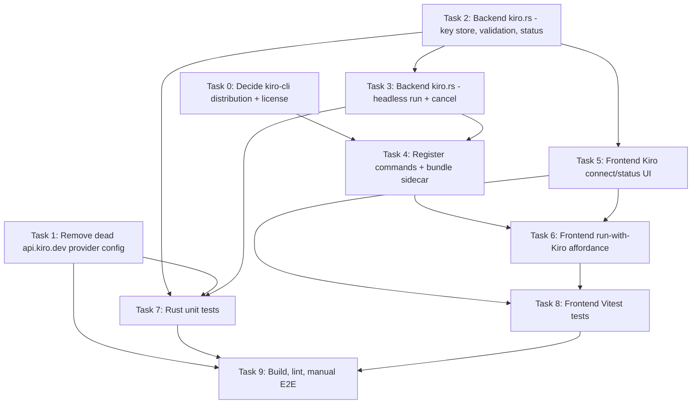

# Implementation Plan

## Overview

This plan integrates **Kiro** into BloxBot as a **separate agent backend** driven
by the bundled `kiro-cli` binary and a user-supplied `KIRO_API_KEY`. It replaces
the original (non-functional) approach that registered a `kiro` OpenCode provider
pointing at the non-existent `https://api.kiro.dev/v1` endpoint.

The work has three strands:
- **Cleanup**: remove the dead `api.kiro.dev` provider config and frontend metadata.
- **Backend**: a new `kiro.rs` module (key storage, validation, headless runs).
- **Frontend**: a Kiro connect/status section and a "run with Kiro" affordance.

> Toolchain note: this machine has **no Rust toolchain** (`cargo`/`rustc`/`rustup`
> are not installed) and `pnpm` is only reachable via `npx`. Tasks that require
> `cargo` (build, clippy, Rust tests) and the full `pnpm tauri dev` E2E are
> **blocked until Rust is installed**. They are marked `[BLOCKED: needs Rust]`.

## Task Dependency Graph

## Tasks

- [ ] 0. Decide `kiro-cli` distribution and confirm license (DECISION GATE)
  - Confirm whether `kiro-cli` may be redistributed inside BloxBot's installer.
    Source binaries are published at `https://cli.kiro.dev/install`.
  - If redistribution is permitted: plan to add `binaries/kiro-cli` per target triple as a Tauri `externalBin`.
  - If NOT permitted: switch Requirement 0 to a "detect `kiro-cli` on PATH and prompt the user to install it" approach; record this decision and adjust Task 4.
  - Document the decision in the design's Open Questions section.
  - _Requirements: 0.1, 0.2_

- [ ] 1. Remove the dead `api.kiro.dev` OpenCode provider config
  - In `src-tauri/src/opencode.rs`: remove the `KIRO_BASE_URL` constant, the `kiro_provider_config()` helper, the `"provider": kiro_provider_config()` entry in `do_start`'s `mcp_config`, and the two Kiro provider unit tests (`kiro_provider_config_has_expected_shape`, `kiro_base_url_is_https`).
  - Confirm the remaining `mcp_config` keys (`plugin`, `mcp`, `default_agent`, `agent`) are unchanged.
  - In `src/components/Settings.tsx`: remove `"kiro"` from `POPULAR_PROVIDERS` and the `PROVIDER_META.kiro` HTTP-provider entry.
  - _Requirements: 7.1, 7.2, 7.3_

- [ ] 2. Backend `kiro.rs`: key store, validation, and status
  - Create `src-tauri/src/kiro.rs` with `KiroState { api_key: Option<String>, child: Option<CommandChild> }`, `SharedKiroState`, and declare `mod kiro;` in `lib.rs`.
  - Implement `is_valid_kiro_key(trimmed) -> bool` (starts with `ksk_`, longer than the prefix; local check only, no network).
  - Implement `kiro_set_key` (trim, validate, persist to an app-local secret store separate from `bloxbot-store.json`, update in-memory state), `kiro_clear_key`, and `kiro_status() -> { connected }`.
  - On startup, load any persisted key into memory so status reflects it.
  - _Requirements: 1.5, 2.1, 2.2, 2.3, 5.2, 6.1, 6.2, 6.3_

- [ ] 3. Backend `kiro.rs`: headless run and cancel
  - Implement `kiro_run(prompt)`: refuse if no key stored (instruct user to connect); otherwise spawn the bundled `kiro-cli` sidecar with args `["chat", "--no-interactive", "--trust-tools=read,grep", <prompt>]` (prompt as a discrete arg), and `.env("KIRO_API_KEY", key)`.
  - Stream stdout/stderr to the frontend via Tauri events; report a terminal state from the exit code. Redact the key from any forwarded line.
  - Implement `kiro_cancel()` to kill the active child. Ensure run failures never exit the app.
  - _Requirements: 3.1, 3.2, 3.3, 3.4, 3.5, 3.6, 3.7, 4.1, 4.2, 4.3, 4.4, 5.5_

- [ ] 4. Register commands and bundle the sidecar
  - Register `kiro_set_key`, `kiro_clear_key`, `kiro_status`, `kiro_run`, `kiro_cancel` in `lib.rs` `invoke_handler`, and `manage(SharedKiroState)`.
  - Per Task 0's decision: either add `binaries/kiro-cli` to `tauri.conf.json` `externalBin` and resolve via `paths::sidecar_dir`, or implement PATH detection with a descriptive error when missing (Req 0.3).
  - Ensure the OpenCode sidecar startup path is unaffected.
  - _Requirements: 0.1, 0.2, 0.3, 0.4_

- [ ] 5. Frontend: Kiro connect/status UI
  - Add a Kiro section to Settings: Connect dialog with `ksk_...` placeholder and a "Get an API key" link opening `https://app.kiro.dev/` via the opener plugin.
  - Wire Save (disabled while empty/whitespace; in-progress state) to `kiro_set_key`; show format errors from the backend and keep the dialog open on failure.
  - Show connected/disconnected status from `kiro_status`; wire Disconnect to `kiro_clear_key` with in-progress + confirmation.
  - _Requirements: 1.1, 1.2, 1.3, 1.4, 1.6, 1.7, 2.2, 5.1, 5.3, 5.4, 6.1, 6.2_

- [ ] 6. Frontend: run-with-Kiro affordance
  - Add a distinct entry point (separate from the OpenCode model picker) to submit a prompt to `kiro_run`, render streamed stdout/stderr, show in-progress + a Cancel control wired to `kiro_cancel`, and a terminal success/failure state.
  - Block the affordance (or prompt to connect) when disconnected.
  - _Requirements: 3.1, 3.4, 3.5, 3.6, 4.1, 5.5_

- [ ] 7. Rust unit tests [BLOCKED: needs Rust]
  - In `kiro.rs` `#[cfg(test)]`: `is_valid_kiro_key` accept/reject cases; key trimming on store; argument-vector construction contains `chat`/`--no-interactive`/prompt and does NOT contain the key; status mirrors store.
  - In `opencode.rs`: regression test that the serialized `mcp_config` contains no `provider.kiro` / `api.kiro.dev` and still has `plugin`/`mcp`/`agent`.
  - Run `cargo test` from `src-tauri/` and confirm pass.
  - _Requirements: 2.1, 2.2, 1.5, 3.3, 6.1, 6.2, 7.1_

- [ ] 8. Frontend Vitest tests
  - Connect dialog shows `ksk_...` placeholder and help link to `https://app.kiro.dev/`.
  - Save disabled on empty/whitespace, enabled otherwise.
  - Invalid-prefix key surfaces a format error and does not complete persistence.
  - Connected renders Disconnect; disconnected renders Connect and blocks the run affordance.
  - Run with `node node_modules/vitest/vitest.mjs run` (or `pnpm test` once pnpm is on PATH) and confirm pass.
  - _Requirements: 1.2, 1.4, 2.2, 5.1, 5.5, 6.1, 6.2_

- [ ] 9. Build, lint, and manual end-to-end [BLOCKED: needs Rust + real Kiro key]
  - Frontend: `tsc --noEmit`, Biome lint, Vitest — all green.
  - Backend (after installing Rust): `cargo fmt`, `cargo clippy`, `cargo test` from `src-tauri/`.
  - `pnpm tauri dev`: connect a real `ksk_...` key, verify status persists across restart, run a prompt and observe streamed output + success, then disconnect and confirm runs are refused.
  - If the bundled `kiro-cli` behavior differs from assumptions (flags, output format, auth errors), document and adjust Task 3/4.
  - _Requirements: 0.3, 0.4, 1.7, 3.5, 3.6, 4.1, 4.2, 5.4, 5.5, 6.1, 7.3_

## Notes

- All Rust commands run from `src-tauri/`; frontend commands use `pnpm` (via
  `npx pnpm` until pnpm is on PATH), never npm/yarn, per AGENTS.md.
- **Hard blockers on this machine**: Rust toolchain is not installed, so Tasks 7
  and 9 (and any `cargo` step in Task 4) cannot be executed/verified here. Kiro
  API keys also require a **Pro/Pro+/Power** subscription for the live E2E.
- **Decision gate**: Task 0 (kiro-cli redistribution license) gates the bundling
  approach in Task 4. Resolve it before implementing Task 4.
- Kiro runs as a **separate agent** (one-shot headless), not a model inside the
  existing OpenCode chat — this is a deliberate consequence of how `kiro-cli`
  works and differs from the original spec's in-chat-model assumption.
